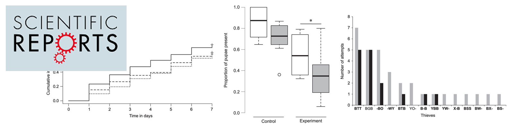
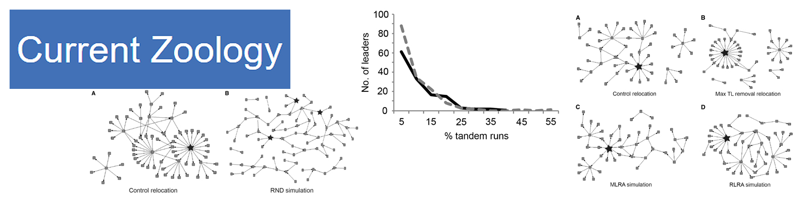

-----------------------------------------

* **Paul, B.**, Paul, M. & Annagiri, S., 2016. Opportunistic brood theft in the context of colony relocation in an Indian queenless ant. *Scientific Reports*, 6 (36166). [Link](http://www.nature.com/articles/srep36166)

{width=85%}

 
Media coverage regarding the publication: [Research Matters](https://researchmatters.in/article/scientists-study-kidnappers-ant-society)

   

* Annagiri, S., Kolay, S., **Paul, B.** & Sona, C., 2016. Network approach to understanding the organization of and the consequence of targeted leader removal on an end-oriented task. *Current Zoology*, p. zow058. [Link](http://cz.oxfordjournals.org/content/early/2016/06/01/cz.zow058)

{width=85%}

-----------------------------------------