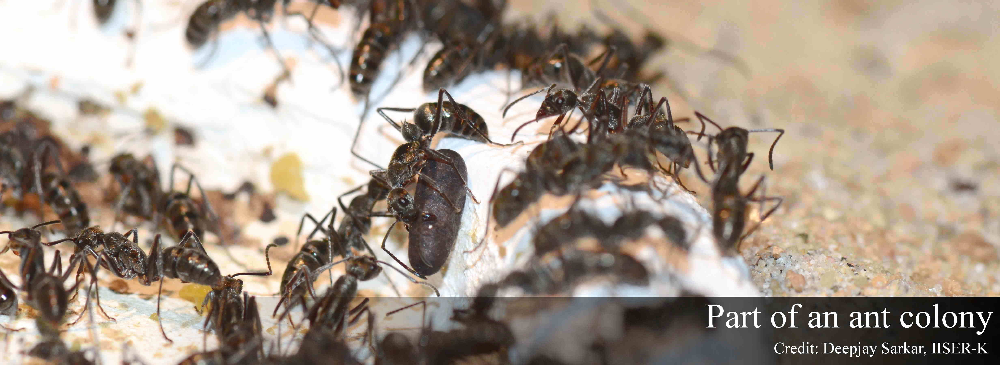
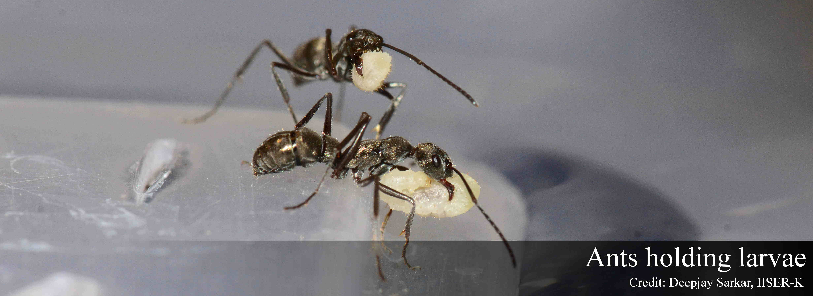
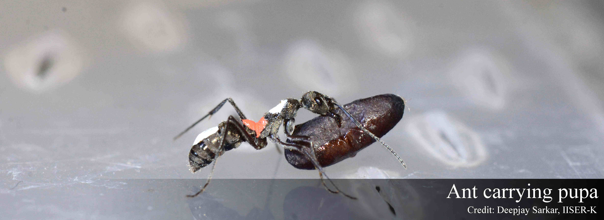

-------------------------------------

Caring for young is a characteristic present throughout the animal kingdom. Brood, consisting of the developmental stages eggs, larvae and pupae, are very important for an ant colony in terms of the survivability of the colony, thus extreme care is given to them by the adult members.  

  

But the extreme importance of brood also means that there will be theft of these valuable items by other ant colonies - whether of the same species or of different species. Theft of important objects such as food, nesting site, brood etc are well documented in several animals, with ants being no exception.  

  

I am currently working on studying brood theft, its mechanisms and consequences in [*Diacamma indicum*](http://www.antwiki.org/wiki/Diacamma_indicum), a primitively eusocial queenless ant found in India, Bangladesh, Sri Lanka and Japan.  

  

-------------------------------------